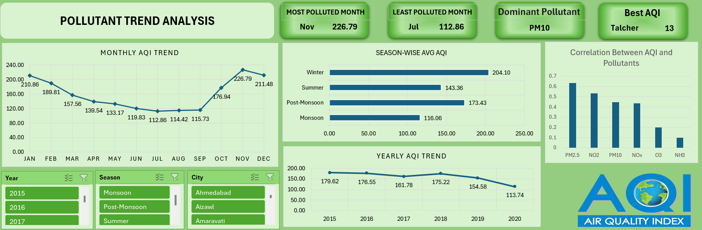
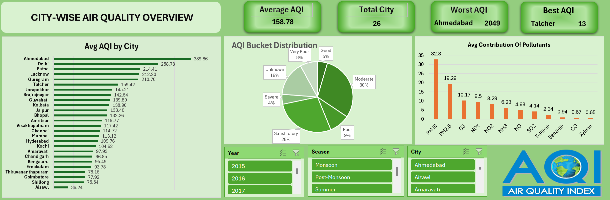

# 🌍 Air Quality Index (AQI) Analysis Dashboard – Excel

## 📊 Dashboard Preview

  

  

---

## 📊 Project Overview

This project presents an interactive **Air Quality Index (AQI) dashboard built using Microsoft Excel** to analyze pollution trends across multiple Indian cities from **2015–2020**.

The dashboard provides insights into:

* Monthly AQI trends
* Seasonal air quality variations
* City-wise pollution comparison
* Pollutant contribution analysis
* Correlation between pollutants and AQI

This project demonstrates how **Excel can be used for data analysis, visualization, and interactive dashboard creation.**

---

## 📁 Dataset

The dataset contains **Air Quality Index (AQI) and pollutant measurements across Indian cities.**

### Key Columns

* City
* Date
* AQI
* AQI Bucket
* PM2.5
* PM10
* NO
* NO2
* NOx
* NH3
* CO
* SO2
* O3
* Benzene
* Toluene
* Xylene

**Time Period:** 2015 – 2020

---

## 📈 Dashboard Features

### 1️⃣ Pollutant Trend Analysis

Shows how AQI changes across months and seasons.

Includes:

* Monthly AQI trends
* Season-wise AQI comparison
* Yearly AQI trend
* Correlation between pollutants and AQI

### 2️⃣ City-wise Air Quality Overview

Provides a comparison of air quality across cities.

Key elements:

* Average AQI by city
* Pollutant contribution analysis
* AQI bucket distribution
* Best and worst AQI cities

---

## 🔍 Key Insights

🌫 **Most Polluted Month:** November – 226.79 AQI
🌱 **Least Polluted Month:** July – 112.86 AQI
🧪 **Dominant Pollutant:** PM10
🏙 **Worst AQI City:** Ahmedabad – 2049
🌿 **Best AQI City:** Talcher – 13

---

## 🛠 Tools & Technologies

* Microsoft Excel
* Pivot Tables
* Data Cleaning
* Dashboard Design
* Data Visualization
* Data Analysis

---

## 📊 Dashboard Components

✔ Monthly AQI Trend Chart
✔ Season-wise AQI Comparison
✔ Yearly AQI Trend
✔ City-wise AQI Distribution
✔ Pollutant Contribution Chart
✔ AQI Bucket Distribution
✔ Interactive Filters (Year, Season, City)

---

## 🚀 Applications

This analysis can help:

* Understand pollution patterns
* Identify most harmful pollutants
* Compare air quality across cities
* Support environmental decision-making
* Monitor seasonal pollution trends

---

## 🔮 Future Improvements

* Power BI interactive dashboard
* Python data analysis using Pandas & Matplotlib
* Machine learning model to predict AQI
* Real-time pollution monitoring

---

## 👨‍💻 Author

**Harshkumar Jadav**
Computer Engineering Student
Interested in **Data Science | Machine Learning | Analytics**

---

⭐ If you like this project, give the repository a **star ⭐**

---

#Excel #DataAnalytics #DataVisualization #Dashboard #AQI #AirPollution #DataScience #ExcelDashboard #Analytics #LearningInPublic
